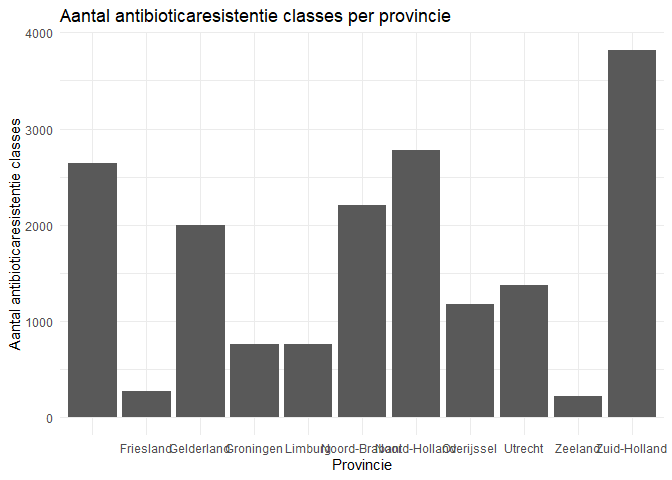

<!-- README.md is generated from README.Rmd. Please edit that file -->

# AMRNetherland

<!-- badges: start -->
<!-- badges: end -->

The goal of AMRNetherland is to provide a suite of tools for analyzing
and visualizing antimicrobial resistance (AMR) data specific to the
Netherlands. This package includes functions to calculate the prevalence
of resistance genes in percentage, filter and summarize data by city and
province, and more. It is designed to help researchers and public health
officials easily access and analyze AMR data to monitor trends, get the
patient data and inform decision-making.

## Installation

You can install the development version of AMRNetherland from
[GitHub](https://github.com/) with:

``` r
# install.packages("devtools")
devtools::install_github("MarianaMousa1/AMRNetherland")
```

## Example

This is a basic example which shows you how to solve a common problem:
Function: Load_metadata

``` r
library(AMRNetherland)
## basic example code
metadata <- Load_metadata("./Data/metadata.txt")
head(metadata)
#>           Plasmid        Parent               Species            tsne1D
#> 1 pRIVM_M100707_1 cRIVM_M100707 Klebsiella pneumoniae                 -
#> 2 pRIVM_M101635_2 cRIVM_M101635 Staphylococcus aureus                 -
#> 3 pRIVM_M101423_1 cRIVM_M101423 Klebsiella pneumoniae 14.63384558802648
#> 4 pRIVM_M100248_2 cRIVM_M100248 Staphylococcus aureus                 -
#> 5 pRIVM_M100148_1 cRIVM_M100148 Staphylococcus aureus                 -
#> 6 pRIVM_M100672_2 cRIVM_M100672 Staphylococcus aureus                 -
#>               tsne2D cluster        mobility     replicon      gc_percentage
#> 1                  -       - non-mobilizable        rep7a 30.247376311844075
#> 2                  -       -     mobilizable        rep7a  47.45853326026811
#> 3 28.554717656983836    -1.0     conjugative No hit found  54.51438336656224
#> 4                  -       - non-mobilizable No hit found  30.44094384392302
#> 5                  -       - non-mobilizable No hit found  57.61888901818999
#> 6                  -       -     conjugative        rep20   30.1010101010101
#>   bp_length       ncbi_genes resfinder_genes virulence_genes antibiotic_class
#> 1   61790.0             blaZ         blaZ_79               -      Beta-lactam
#> 2    2496.0             blaZ         blaZ_79  iroC,iroE,iroN      Beta-lactam
#> 3    4446.0             blaZ               -               -                -
#> 4    2457.0 blaNDM-5,ble-MBL      blaNDM-5_1               -      Beta-lactam
#> 5    4167.0              str           str_2               -   Aminoglycoside
#> 6    5676.0           erm(C)       erm(C)_13               -        Macrolide
#>   n_classes_resistent run_info sampling_date  culture_material
#> 1                   1 Existing    17-07-2018         Wondvocht
#> 2                   1 Existing    19-05-2023         Wondvocht
#> 3                   0 Existing    25-08-2022             Urine
#> 4                   1 Existing    10-07-2020   Swab van rectum
#> 5                   1 Existing    23-03-2023 Swab van perineum
#> 6                   1 Existing    21-11-2013             Urine
#>        institute_name institute_city institute_province institute_region
#> 1    MML St. Antonius     Nieuwegein            Utrecht               NA
#> 2      MML Erasmus MC      Rotterdam       Zuid-Holland               NA
#> 3      MML Laurentius       Roermond                                  NA
#> 4    MML St. Antonius     Nieuwegein            Utrecht               NA
#> 5  MML STAR-SHL R'dam      Rotterdam       Zuid-Holland               NA
#> 6 MML Certe Groningen      Groningen          Groningen               NA
#>   person_gender person_age_months person_age_year person_birthyear
#> 1         Vrouw                NA              76             1942
#> 2         Vrouw                NA              31               NA
#> 3           Man                NA              82             1937
#> 4           Man                NA              47             1974
#> 5           Man                NA              71               NA
#> 6         Vrouw                NA              63             1959
#>   person_zipcode person_city person_province person_country person_traveled_to
#> 1           6176    Spaubeek         Limburg                                  
#> 2           1012   Amsterdam   Noord-Holland                                  
#> 3           9113 Wâlterswâld       Friesland                                  
#> 4           3072   Rotterdam    Zuid-Holland                            Egypte
#> 5           3815  Amersfoort         Utrecht                                  
#> 6           8071    Nunspeet      Gelderland                                  
#>   healthcare_employee
#> 1                 Nee
#> 2                    
#> 3                    
#> 4                 Nee
#> 5            Onbekend
#> 6                 Nee
```

Function: calculate_resgene_prevalence

``` r
library(AMRNetherland)
## basic example code
  gene <- "blaZ_79"  # Vervang dit door het specifieke resistentiegen waarvan je de prevalentie wilt berekenen
  data <- read.csv2("./Data/metadata.txt")  # Vervang "jouw_data.csv" door de naam van je dataset

calculate_resgene_prevalence(gene, data)
#> [1] "De prevalentie van dit resistentiegen is 4.7607619619019 %"
```

Function: get_antibiotic_class

``` r
library(AMRNetherland)
## basic example code
   zipcode <- "8071"  # Vervang dit door de werkelijke postcode
  year_of_birth <- 1959  # Vervang dit door het werkelijke geboortejaar
  data <- read.csv2("./Data/metadata.txt")  # Vervang "jouw_data.csv" door de naam van je dataset

  antibiotic_class <- get_antibiotic_class(zipcode, year_of_birth, data)
  print(antibiotic_class)
#> [1] "Antibiotic Class: Macrolide, NA"
```

Function: get_date_info

``` r
library(AMRNetherland)
## basic example code
 date <- 16-06-2023
   data <- read.csv2("./Data/metadata.txt")
get_date_info <- get_date_info(data, date)
head(get_date_info)
#>   institute_city institute_province person_gender
#> 1     Nieuwegein            Utrecht         Vrouw
#> 2      Rotterdam       Zuid-Holland         Vrouw
#> 3       Roermond                              Man
#> 4     Nieuwegein            Utrecht           Man
#> 5      Rotterdam       Zuid-Holland           Man
#> 6      Groningen          Groningen         Vrouw
```

Function: plot_ab_reis

``` r
library(AMRNetherland)
## basic example code
   data <- read.csv2("./Data/metadata.txt")
 plot_ab_resis(data)
#> 
#> Attaching package: 'dplyr'
#> The following objects are masked from 'package:stats':
#> 
#>     filter, lag
#> The following objects are masked from 'package:base':
#> 
#>     intersect, setdiff, setequal, union
```



You’ll still need to render `README.Rmd` regularly, to keep `README.md`
up-to-date. `devtools::build_readme()` is handy for this.

In that case, don’t forget to commit and push the resulting figure
files, so they display on GitHub and CRAN.
